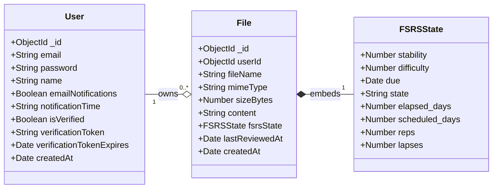

# MÔ TẢ CÁC ĐỐI TƯỢNG CƠ SỞ DỮ LIỆU

#### 5.1. Đối tượng User (Người dùng)

Đối tượng User lưu trữ thông tin tài khoản trong hệ thống. Khóa chính là trường `_id` kiểu ObjectId, được MongoDB tự động sinh. Trường `email` đóng vai trò định danh nghiệp vụ, có ràng buộc UNIQUE để đảm bảo không có hai tài khoản trùng địa chỉ email. Giá trị email được chuẩn hóa thông qua các thuộc tính `lowercase: true` và `trim: true`, loại bỏ khoảng trắng và chuyển về chữ thường trước khi lưu trữ. Trường `password` lưu giá trị đã được mã hóa bằng thuật toán bcrypt, với ràng buộc `minlength: 6` áp dụng ở tầng kiểm tra hợp lệ. Trường `name` lưu tên hiển thị, được sử dụng trong giao diện và mẫu email.

Cơ chế xác thực email được thực hiện thông qua ba trường: `isVerified` (kiểu Boolean, mặc định `false`), `verificationToken` (kiểu String, có thể null), và `verificationTokenExpires` (kiểu Date, có thể null). Mã thông báo xác thực có thời hạn sử dụng, sau khi hết hạn sẽ không còn hiệu lực. Trạng thái `isVerified` chuyển sang `true` khi mã thông báo được xác nhận thành công.

Cấu hình thông báo được quản lý qua hai trường: `emailNotifications` (kiểu Boolean, mặc định `true`) điều khiển việc gửi email nhắc nhở, và `notificationTime` (kiểu String, mặc định "09:00") xác định thời điểm trong ngày để gửi thông báo. Định dạng thời gian là "HH:MM", lưu dưới dạng chuỗi để đơn giản hóa việc so sánh trong tác vụ định kỳ.

Trường dấu thời gian `createdAt` được Mongoose tự động quản lý thông qua tùy chọn `timestamps: true` trong định nghĩa lược đồ. Trường này được sử dụng làm cơ sở cho chỉ mục có thời gian sống.

Chỉ mục có thời gian sống được định nghĩa trên trường `createdAt` với cấu hình `expireAfterSeconds: 3600` và `partialFilterExpression: { isVerified: false }`. Chỉ mục này kích hoạt tác vụ nền tự động xóa các tài liệu có `isVerified: false` sau 3600 giây (1 giờ) kể từ khi được tạo. Cơ chế này ngăn chặn cơ sở dữ liệu phình to do các tài khoản không được kích hoạt.

#### 5.2. Đối tượng File (Tài liệu học tập)

Đối tượng File là thực thể trung tâm, lưu trữ tài liệu học tập và trạng thái thuật toán lặp lại ngắt quãng. Khóa chính là `_id` kiểu ObjectId. Trường `userId` là khóa ngoại tham chiếu đến bộ sưu tập User, được định nghĩa với kiểu `Schema.Types.ObjectId` và thuộc tính `ref: 'User'`, thiết lập mối quan hệ một-nhiều giữa User và File.

Siêu dữ liệu của tài liệu bao gồm: `fileName` (kiểu String, tên tệp gốc bao gồm phần mở rộng), `mimeType` (kiểu String, loại MIME như "application/pdf", "text/plain"), và `sizeBytes` (kiểu Number, kích thước tính bằng bytes). Ba trường này đều có ràng buộc `required: true`.

Trường `content` (kiểu String, bắt buộc) lưu trữ nội dung văn bản đã được trích xuất từ tệp gốc. Việc lưu giữ nội dung đã trích xuất vào cơ sở dữ liệu thay vì phân tích theo yêu cầu giảm độ trễ khi truy vấn và giảm sự phụ thuộc vào giao diện lập trình ứng dụng bên ngoài.

Thành phần cốt lõi là `fsrsState`, một tài liệu con nhúng chứa trạng thái thuật toán FSRS. Tài liệu con này được định nghĩa với `_id: false` để tránh tạo ObjectId không cần thiết. Cấu trúc FSRSState bao gồm 8 trường:

Trường `stability` (kiểu Number, bắt buộc) đại diện cho độ ổn định trí nhớ, đơn vị là ngày. Trường `difficulty` (kiểu Number, bắt buộc) là độ khó của nội dung, thang đo từ 0 (dễ nhất) đến 10 (khó nhất). Trường `due` (kiểu Date, bắt buộc) là dấu thời gian của thời điểm tối ưu cho lần ôn tập tiếp theo, được tính toán bởi thuật toán FSRS dựa trên độ ổn định và tỷ lệ ghi nhớ mong muốn. Trường này được sử dụng bởi tác vụ cron hàng ngày để xác định tài liệu nào cần nhắc nhở người dùng ôn tập.

Trường `state` (kiểu String, liệt kê, bắt buộc) là trạng thái học tập hiện tại, có thể là 'new', 'learning', 'review', hoặc 'relearning'. Trường `elapsed_days` (kiểu Number, bắt buộc) là số ngày thực tế đã trôi qua kể từ lần ôn tập trước đến ôn tập hiện tại. Trường `scheduled_days` (kiểu Number, bắt buộc) là số ngày được thuật toán lên lịch cho khoảng thời gian hiện tại. Trường `reps` (kiểu Number, bắt buộc) là số lần ôn tập thành công (đánh giá >= 3). Trường `lapses` (kiểu Number, bắt buộc) là số lần đánh giá = 1 (Again), cho biết số lần nội dung bị quên hoàn toàn.

Quyết định sử dụng tài liệu nhúng thay vì tạo bộ sưu tập riêng cho FSRSState dựa trên hai lý do kỹ thuật: thứ nhất là đảm bảo cập nhật nguyên tử - cập nhật siêu dữ liệu tệp và trạng thái FSRS trong một thao tác duy nhất, tránh mất tính nhất quán; thứ hai là tối ưu hiệu suất truy vấn - không cần thao tác nối bảng khi truy vấn danh sách tệp kèm trạng thái.

Trường `lastReviewedAt` (kiểu Date, có thể null) ghi lại dấu thời gian của sự kiện ôn tập gần nhất. Trường `createdAt` (kiểu Date) được Mongoose tự động quản lý, sử dụng để sắp xếp tệp theo thứ tự tạo.

Đối tượng File có chỉ mục kết hợp `{ userId: 1, 'fsrsState.due': 1 }`. Chỉ mục này tối ưu hóa mẫu truy vấn phổ biến nhất: "tìm tất cả tệp có `fsrsState.due <= thời_điểm_hiện_tại` của một userId cụ thể". Thứ tự trường trong chỉ mục kết hợp quan trọng - `userId` đứng trước vì mọi truy vấn đều lọc theo userId trước (cô lập dữ liệu), sau đó mới lọc theo ngày đến hạn.

#### 5.3. Quan hệ giữa các đối tượng

Mô hình cơ sở dữ liệu gồm hai đối tượng chính với User là thực thể gốc. Quan hệ User-File là một-nhiều: một tài liệu User có thể được tham chiếu bởi nhiều tài liệu File thông qua trường `userId`, nhưng mỗi File chỉ tham chiếu đúng một User. MongoDB không ép buộc tính toàn vẹn tham chiếu ở cấp độ cơ sở dữ liệu, do đó mã nguồn ứng dụng phải đảm bảo không tạo File với `userId` không tồn tại.

Mô hình này cho phép truy vấn chính: lấy tất cả tệp của một tài khoản với `File.find({ userId })`. Truy vấn này được sử dụng trong hai ngữ cảnh quan trọng: thứ nhất là hiển thị danh sách tài liệu của người dùng trong giao diện; thứ hai là tác vụ cron hàng ngày lọc các tệp có `fsrsState.due` đến hạn để gửi email nhắc nhở.

#### 5.4. Sơ đồ minh họa

