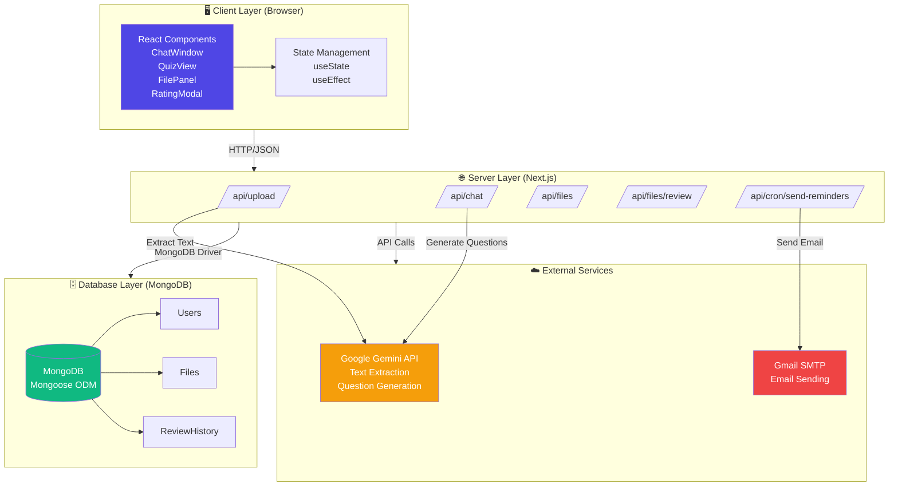
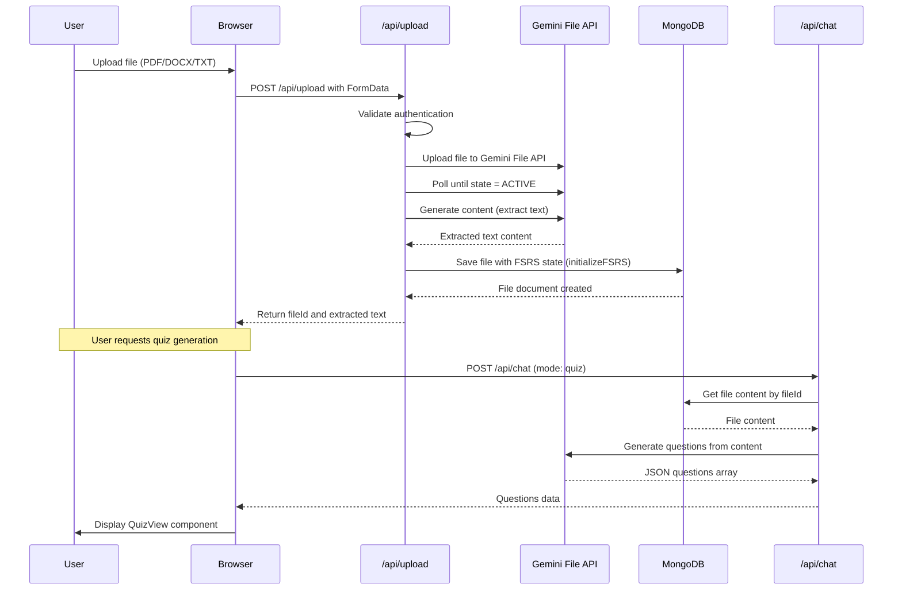
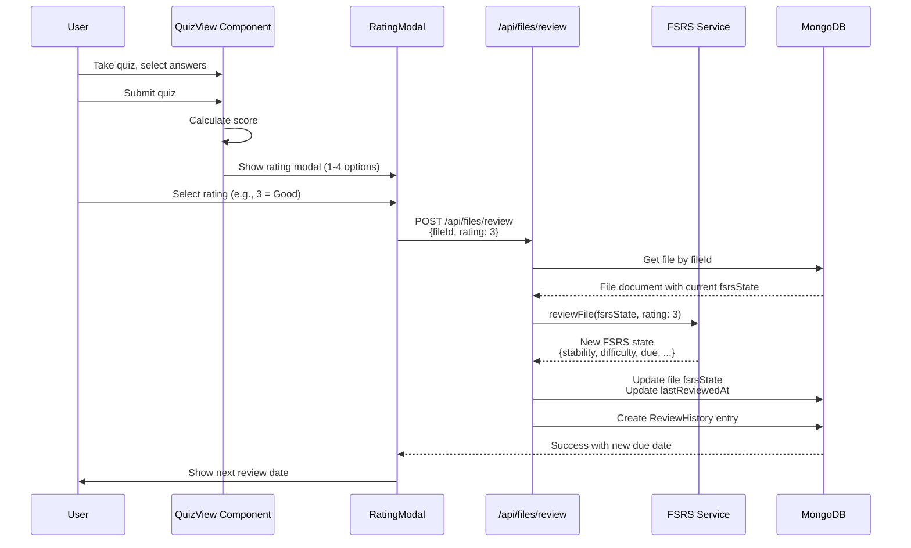
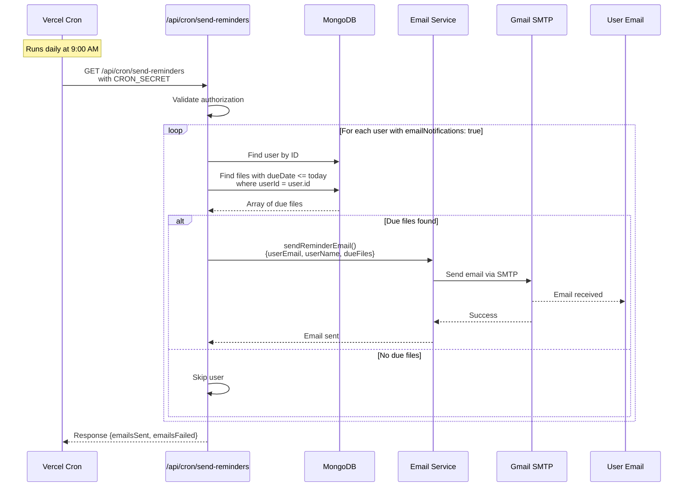
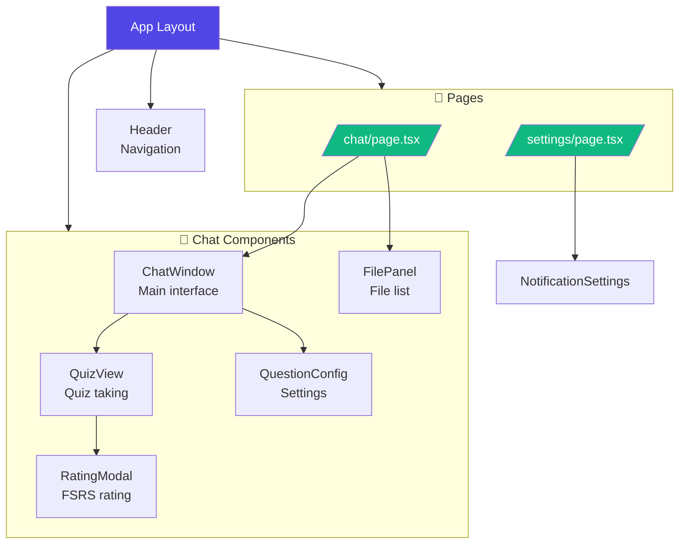
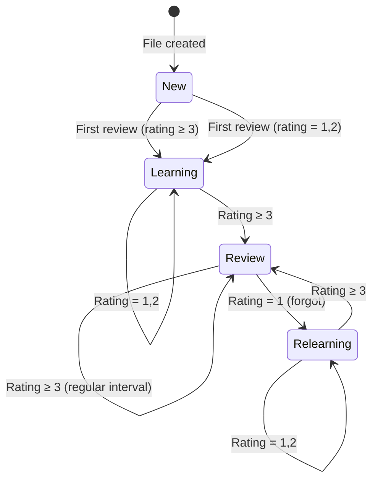
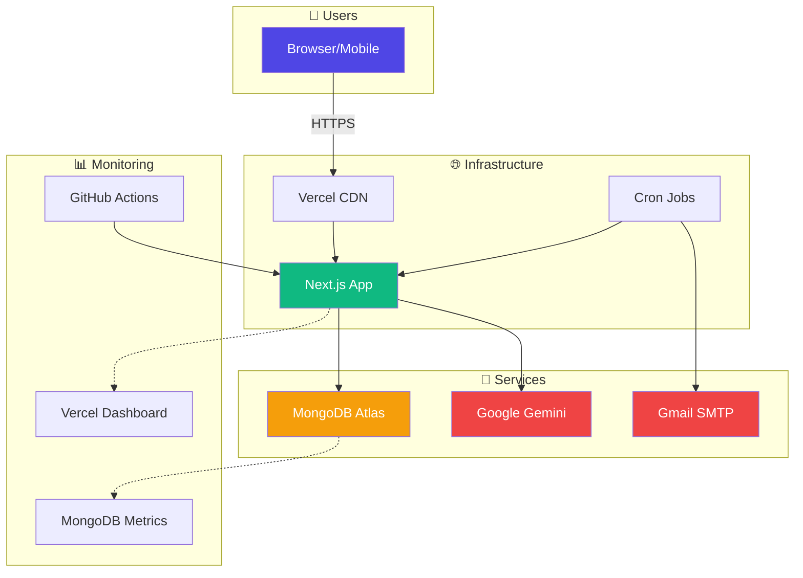
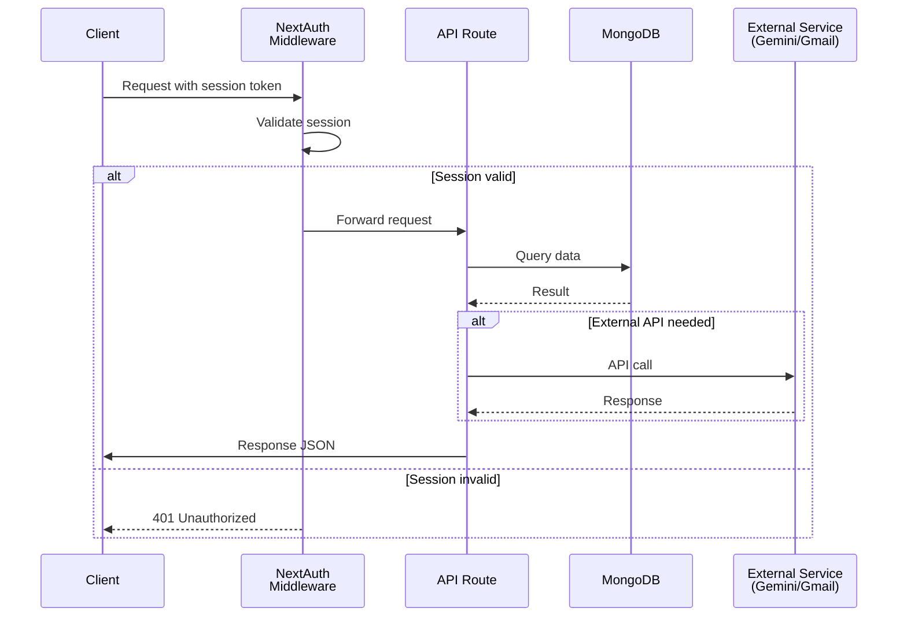

# BÁO CÁO KỸ THUẬT: TRIỂN KHAI HỆ THỐNG EDUGEN VN

## 1. Tổng quan hệ thống

EduGen VN là một ứng dụng web giáo dục cho phép người dùng tải lên tài liệu học tập và tự động tạo câu hỏi trắc nghiệm từ nội dung tài liệu bằng trí tuệ nhân tạo. Hệ thống tích hợp thuật toán lặp lại ngắt quãng FSRS (Free Spaced Repetition Scheduler) để tối ưu hóa việc ghi nhớ thông tin, đi kèm với hệ thống email nhắc nhở tự động.

Dự án được phát triển theo kiến trúc Full-Stack Monolithic sử dụng Next.js 16 với TypeScript, kết nối MongoDB qua Mongoose ODM, và tích hợp Google Gemini AI để xử lý nội dung tài liệu và tạo câu hỏi tự động.

### 1.1. Các tính năng chính

- **Upload tài liệu đa định dạng**: Hỗ trợ PDF, DOCX, TXT
- **Trích xuất nội dung tự động**: Sử dụng Gemini File API để đọc nội dung từ tài liệu
- **Tạo câu hỏi trắc nghiệm**: AI tự động tạo câu hỏi với 4 đáp án và giải thích chi tiết
- **Hệ thống ôn tập thông minh**: Thuật toán FSRS tính toán lịch review tối ưu
- **Nhắc nhở email**: Cron job tự động gửi email khi đến hạn ôn tập
- **Quản lý file theo user**: Mỗi user quản lý riêng biệt các file và lịch sử ôn tập
- **Chế độ đa dạng**: Ôn tập trắc nghiệm, Xuất đề thi (có đáp án), Chat tự do

---

## 2. Kiến trúc hệ thống

### 2.1. Tổng quan kiến trúc

Hệ thống EduGen VN được xây dựng theo kiến trúc Client-Server với các thành phần chính:

**Hình 2.1. Sơ đồ kiến trúc tổng thể của hệ thống EduGen VN**



Hệ thống được cấu trúc thành bốn lớp chính: lớp Client (giao diện người dùng), lớp Server (Next.js API Routes), lớp Database (MongoDB) và lớp External Services (Gemini, Gmail). Lớp Client sử dụng React components để quản lý trạng thái và giao tiếp với lớp Server thông qua giao thức HTTP/JSON. Server Layer đóng vai trò trung gian xử lý các yêu cầu, kết nối với Database Layer để lưu trữ và truy xuất dữ liệu, đồng thời tích hợp với External Services cho các chức năng xử lý nội dung và gửi email. Luồng dữ liệu tuân theo kiến trúc hướng sự kiện, trong đó các yêu cầu từ Client được điều phối bởi Server Layer trước khi tương tác với các thành phần hạ tầng.

### 2.2. Luồng dữ liệu chính

**Hình 2.2(a). Sơ đồ trình tự quy trình upload tài liệu và sinh câu hỏi trắc nghiệm**



Quy trình khởi đầu khi người dùng tải tài liệu lên hệ thống thông qua giao diện trình duyệt. Tệp tin được định dạng và chuyển đến endpoint `/api/upload` để xác thực và xử lý. Trong trường hợp tài liệu không phải là văn bản thuần (PDF, DOCX), hệ thống thực hiện tải tệp tin lên Gemini File API và thực hiện polling trạng thái cho đến khi tài liệu được xử lý hoàn tất. Sau đó, nội dung văn bản được trích xuất thông qua model `gemini-2.5-flash` và lưu trữ vào MongoDB cùng với trạng thái FSRS khởi tạo. Sau khi tài liệu đã được lưu trữ, người dùng có thể yêu cầu tạo câu hỏi thông qua `/api/chat` với chế độ `quiz`. API truy xuất nội dung từ MongoDB, gửi đến Gemini để sinh câu hỏi, và kết quả trả về dưới dạng mảng JSON được hiển thị trên QuizView component.

**Hình 2.2(b). Sơ đồ trình tự quy trình ôn tập và cập nhật trạng thái FSRS**



Sau khi người dùng hoàn thành bài trắc nghiệm trên QuizView, hệ thống kích hoạt modal đánh giá với bốn mức độ ghi nhớ: 1 (Again), 2 (Hard), 3 (Good), 4 (Easy). Đánh giá được chuyển đến endpoint `/api/files/review` cùng với định danh tài liệu (fileId). API thực hiện truy xuất trạng thái FSRS hiện tại từ MongoDB, gọi thuật toán FSRS để tính toán trạng thái mới dựa trên đánh giá, sau đó cập nhật các tham số `stability`, `difficulty`, `due`, `reps`, và `lapses` vào cơ sở dữ liệu. Đồng thời, một bản ghi lịch sửôntập được tạo trong collection `review_history` để phục vụ cho phân tích dữ liệu. Hệ thống thông báo cho người dùng về ngày ôn tập tiếp theo dựa trên tham số `due` được cập nhật.

**Hình 2.2(c). Sơ đồ trình tự quy trình gửi email nhắc nhở tự động**



**Hình 2.2(c).** Sơ đồ trình tự mô tả quy trình gửi email nhắc nhở tự động thông qua cơ chế cron job định kỳ. Hệ thống sử dụng Vercel Cron để kích hoạt endpoint `/api/cron/send-reminders` vào lúc 9:00 AM hàng ngày. Trước khi xử lý, API xác thực yêu cầu thông qua header `Authorization` chứa `CRON_SECRET` để đảm bảo tính bảo mật. Sau đó, hệ thống thực hiện vòng lặp qua tất cả người dùng có bật tính năng thông báo (`emailNotifications: true`). Với mỗi người dùng, hệ thống truy vấn MongoDB để tìm các tài liệu có ngày đến hạn (`dueDate`) nhỏ hơn hoặc bằng ngày hiện tại. Nếu có tài liệu đến hạn, API gọi dịch vụ Email để gửi thông báo qua giao thức SMTP của Gmail. Email được cấu trúc để hiển thị danh sách tài liệu quá hạn (nếu có) và các tài liệu cần ôn trong ngày, cùng với liên kết trực tiếp đến ứng dụng. API trả về thống kê tổng kết bao gồm số lượng email đã gửi và số lượng thất bại cho mục đích monitoring.

---

---

## 3. Công nghệ sử dụng

### 3.1. Backend Framework: Next.js 16

Next.js được lựa chọn vì:

- **Server-Side Rendering (SSR)**: Tối ưu SEO và hiệu năng tải trang
- **API Routes**: Xây dựng RESTful API trong cùng codebase với frontend
- **Server Actions**: Thực thi logic nghiệp vụ trực tiếp trên server
- **TypeScript support**: Full-stack typing giúp giảm lỗi runtime
- **Vercel deployment**: Deploy với zero-configuration

**Cấu trúc API Routes:**
```
/app/api/
├── upload/route.ts          # Upload file và trích xuất nội dung
├── chat/route.ts            # Chat với Gemini (quiz/exam/text modes)
├── generate/route.ts        # Legacy endpoint (được thay thế bởi chat)
├── files/
│   ├── route.ts             # GET (list), DELETE (remove)
│   └── review/route.ts      # POST (submit rating)
├── cron/
│   └── send-reminders/route.ts  # Cron endpoint
├── user/
│   ├── settings/route.ts     # GET/PATCH email preferences
│   └── test-email/route.ts  # POST test email
└── auth/
    ├── register/route.ts     # Register new user
    └── [...nextauth]/route.ts # NextAuth authentication
```

### 3.2. Ngôn ngữ lập trình: TypeScript

TypeScript được sử dụng toàn bộ dự án (frontend + backend) vì:

- **Static type checking**: Phát hiện lỗi tại compile-time, giảm 15% bugs (Gao et al, 2017)
- **IntelliSense support**: IDE autocomplete giúp phát triển nhanh hơn
- **Interface definitions**: Type definitions cho API requests/responses (`/lib/types.ts`)
- **Full-stack type safety**: Types được chia sẻ giữa server và client

**Ví dụ type definition:**
```typescript
export interface ExamConfig {
  mode: ExamMode;                    // 'standard' | 'thpt2025'
  studyMode: boolean;                // Có hiển thị giải thích không
  numberOfQuestions?: number;         // Số câu hỏi
  difficultyLevel?: 'easy' | 'medium' | 'hard';
}

export interface Question {
  type: 'standard' | 'thpt2025';
  id: string;
  question: string;
  options?: { A: string; B: string; C: string; D: string };
  correctAnswer?: 'A' | 'B' | 'C' | 'D';
  correctAnswers?: { a: boolean; b: boolean; c: boolean; d: boolean };
  explanation?: string;
  hint?: string;
}
```

### 3.3. Database: MongoDB + Mongoose

MongoDB được lựa chọn vì:

- **Schema-less**: Phù hợp với dữ liệu JSON động từ Gemini API
- **Embedded documents**: Lưu chuỗi messages trong một document, tránh JOIN
- **Atomic updates**: Các toán tử `$set`, `$inc` trên subdocument giúp update FSRS state nhanh
- **Aggregation pipeline**: Xử lý các query phức tạp như phân loại file theo priority
- **Horizontal scaling**: Sharding hỗ trợ mở rộng khi số lượng user tăng

**Mongoose ODM benefits:**
- Schema validation: Tự động validate dữ liệu trước khi save
- Middleware: Hooks như `pre('save')` để xử lý logic
- Methods: Định nghĩa methods trực tiếp trên model (ví dụ: `file.getReviewStatus()`)
- Populate: Tự động JOIN các referenced documents

### 3.4. AI Integration: Google Gemini AI

Gemini API được sử dụng cho:

- **Text extraction**: Trích xuất nội dung từ PDF/DOCX sử dụng `GoogleAIFileManager`
- **Question generation**: Tạo câu hỏi trắc nghiệm từ nội dung tài liệu
- **Chat functionality**: Chat tự do với AI về nội dung tài liệu

**Thư viện**: `@google/generative-ai` (phiên bản hiện tại, **bị deprecated từ 16/12/2025**, cần migrate sang `@google/genai`)

**Mô hình sử dụng**: `gemini-2.5-flash` (tốc độ cao, chi phí thấp)

---

## 4. Thiết kế Database

### 4.1. Schema Overview

Hệ thống sử dụng 3 main collections: `users`, `files`, `review_history`

**Hình 4.1. Sơ đồ thực thể liên kết mô tả cấu trúc cơ sở dữ liệu**

---

### 4.2. User Schema

**File**: `/lib/models/User.ts`

```typescript
{
  username: String,              // Unique
  email: String,                 // Unique
  passwordHash: String,          // bcrypt hash

  // Email notification settings
  emailNotifications: Boolean,    // default: true
  notificationTime: String,       // format: "HH:MM", default: "09:00"

  createdAt: Date,
  updatedAt: Date
}
```

**Indexes:**
- `{ username: 1 }` - Unique index
- `{ email: 1 }` - Unique index

### 4.3. File Schema

**File**: `/lib/models/File.ts`

```typescript
{
  userId: ObjectId,              // Reference to User

  // File metadata
  fileName: String,
  mimeType: String,               // application/pdf, text/plain, etc.
  sizeBytes: Number,
  content: String,                // Extracted text content

  // Gemini file reference (for non-text files)
  geminiFileId: String,          // Optional
  uri: String,                   // Optional

  // FSRS state (core of spaced repetition system)
  fsrsState: {
    state: String,               // 'new' | 'learning' | 'review' | 'relearning'
    stability: Number,           // Memory stability (days)
    difficulty: Number,          // Difficulty rating (1-10)
    due: Date,                   // Next review date
    elapsed_days: Number,        // Days since last review
    scheduled_days: Number,      // Days scheduled for review
    reps: Number,                // Successful reviews count
    lapses: Number               // Forgotten count
  },

  lastReviewedAt: Date,           // Optional
  createdAt: Date,
  updatedAt: Date
}
```

**Indexes:**
- `{ userId: 1 }` - Index cho queries theo user
- `{ userId: 1, 'fsrsState.due': 1 }` - Compound index cho finding due files
- `{ 'fsrsState.due': 1 }` - Index cho cron job

**FSRS State Fields Explanation:**
- `state`: Trạng thái hiện tại của card (new = chưa review, learning = đang học, review = ôn định kỳ)
- `stability`: Độ ổn định của trí nhớ (đơn vị: ngày), càng cao càng khó quên
- `difficulty`: Độ khó của card (1 = dễ nhất, 10 = khó nhất)
- `due`: Ngày cần review tiếp theo
- `reps`: Số lần review thành công liên tiếp
- `lapses`: Số lần quên (rating = Again)

### 4.4. ReviewHistory Schema

**File**: `/lib/models/ReviewHistory.ts`

```typescript
{
  userId: ObjectId,              // Reference to User
  fileId: ObjectId,              // Reference to File

  // Review data
  rating: Number,                // 1 = Again, 2 = Hard, 3 = Good, 4 = Easy
  reviewedAt: Date,

  // FSRS state snapshot (for analytics)
  oldFsrsState: {
    stability: Number,
    difficulty: Number,
    state: String,
    reps: Number,
    lapses: Number
  },
  newFsrsState: {
    // Same structure as oldFsrsState
  },

  createdAt: Date,
  updatedAt: Date
}
```

**Indexes:**
- `{ userId: 1 }` - Index cho analytics theo user
- `{ fileId: 1 }` - Index cho history của một file
- `{ reviewedAt: -1 }` - Index cho sắp xếp theo thời gian

---

## 5. Triển khai Backend

### 5.1. Upload API (`/api/upload/route.ts`)

**Flow:**
1. **Authentication**: Kiểm tra session NextAuth
2. **File validation**: Kiểm tra file tồn tại và không rỗng
3. **Text extraction**:
   - **Plain text files**: Đọc trực tiếp với `buffer.toString('utf-8')`
   - **Other formats**:
     - Lưu file vào `/tmp` directory
     - Upload lên Gemini File API với `GoogleAIFileManager`
     - Poll state cho đến khi `state !== 'PROCESSING'`
     - Gọi Gemini API để extract text: `model.generateContent([{fileData}, prompt])`
4. **Save to MongoDB**: Tạo File document với `fsrsState: initializeFSRS()`
5. **Cleanup**: Xóa temp file

**Code snippet:**
```typescript
const newFile = await File.create({
  userId: session.user.id,
  fileName: file.name,
  mimeType: file.type,
  sizeBytes: file.size,
  content: extractedText,
  geminiFileId: geminiFileName,
  uri: geminiFileUri,
  fsrsState: initializeFSRS(),  // Initializes FSRS state with defaults
});
```

### 5.2. Chat API (`/api/chat/route.ts`)

**Modes:**
- `quiz`: Tạo câu hỏi cho học sinh làm (không hiển thị đáp án)
- `exam`: Tạo đề thi với đáp án cho giáo viên
- `chat`: Chat tự do về nội dung

**Prompt engineering:**
```typescript
if (mode === 'quiz') {
  prompt = `Bạn là một giáo viên chuyên nghiệp người Việt Nam.
YÊU CẦU CỦA HỌC SINH: ${message}
${fileContent ? `TÀI LIỆU HỌC TẬP:\n${fileContent}\n\n` : ''}

Hãy tạo ${numberOfQuestions} câu hỏi trắc nghiệm để học sinh ôn tập.

QUY TẮC:
- Tạo CHÍNH XÁC ${numberOfQuestions} câu hỏi trắc nghiệm tiêu chuẩn với 4 đáp án A, B, C, D
- KHÔNG được hiển thị đáp án đúng ngay (học sinh sẽ làm bài)
- Các đáp án phải hợp lý, không quá hiển nhiên

ĐỊNH DẠNG ĐẦU RA (JSON):
[
  {
    "id": "q1",
    "question": "Câu hỏi ở đây?",
    "options": { "A": "...", "B": "...", "C": "...", "D": "..." },
    "correctAnswer": "A",
    "explanation": "Giải thích chi tiết"
  }
]

Chỉ trả về mảng JSON, không thêm text nào khác.`;
}
```

**Response parsing:**
```typescript
const text = response.text();
const jsonMatch = text.match(/\[[\s\S]*\]/);  // Extract JSON array
if (jsonMatch) {
  const questions = JSON.parse(jsonMatch[0]);
  return NextResponse.json({ type: 'quiz', questions });
}
```

### 5.3. Files API (`/api/files/route.ts`)

**GET - List user's files:**
```typescript
const files = await File.find({ userId: session.user.id })
  .sort({ createdAt: -1 })
  .select('-content');  // Exclude large content field

// Add review status to each file
const filesWithStatus = files.map(file => ({
  ...file.toObject(),
  reviewStatus: getReviewStatus(file.fsrsState)
}));
```

**DELETE - Remove file:**
```typescript
const { fileId } = new URL(request.url).searchParams;
await File.findOneAndDelete({
  _id: fileId,
  userId: session.user.id  // Security: ensure owner
});
```

### 5.4. Review API (`/api/files/review/route.ts`)

**Flow:**
1. Validate request (`fileId`, `rating`)
2. Fetch file from MongoDB
3. Call `reviewFile(fsrsState, rating)` from `/lib/fsrs.ts`
4. Update file with new FSRS state
5. Create ReviewHistory entry
6. Return success with next review date

**Code snippet:**
```typescript
const { fileId, rating } = await request.json();
const file = await File.findById(fileId);

// FSRS calculation
const newState = reviewFile(file.fsrsState, rating);

// Update file
await File.findByIdAndUpdate(fileId, {
  fsrsState: newState,
  lastReviewedAt: new Date()
});

// Create history
await ReviewHistory.create({
  userId: file.userId,
  fileId: fileId,
  rating: rating,
  oldFsrsState: file.fsrsState,
  newFsrsState: newState,
  reviewedAt: new Date()
});
```

---

## 6. Triển khai Frontend

### 6.1. Component Structure

```
/app/
├── chat/
│   ├── page.tsx              # Main chat page
│   └── components/
│       ├── ChatWindow.tsx    # Chat interface
│       ├── FilePanel.tsx     # File list with FSRS badges
│       ├── QuizView.tsx      # Quiz taking UI
│       ├── RatingModal.tsx   # FSRS rating UI
│       └── QuestionConfig.tsx # Question config modal
├── settings/
│   └── page.tsx              # Email preferences
└── components/
    └── Header.tsx            # Navigation header
```

**Component Hierarchy:**



**Hình 6.1.** Sơ đồ phân cấp component mô tả cấu trúc giao diện người dùng của ứng dụng EduGen VN. Giao diện được xây dựng dựa trên kiến trúc React với mô hình composition, trong đó các component cha chứa và quản lý các component con theo phân cấp logic. App Layout đóng vai trò là container chính, quản lý trạng thái toàn cục và render các component được chia sẻ như Header và Footer. Tại cấp độ trang, các page component (`chat/page.tsx`, `settings/page.tsx`) chịu trách nhiệm quản lý logic cụ thể cho từng chức năng. Trên trang chat, hệ thống được chia thành các chức năng con: FilePanel hiển thị danh sách tài liệu cùng với thông tin trạng thái FSRS, ChatWindow cung cấp giao diện chat chính với AI, QuizView xử lý logic hiển thị và tương tác với bài trắc nghiệm, RatingModal thu thập đánh giá độ ghi nhớ của người dùng, và QuestionConfig cho phép cấu hình các tham số sinh câu hỏi. Các components được thiết kế theo nguyên tắc Single Responsibility, cho phép tái sử dụng và maintain dễ dàng. Cấu trúc phân cấp này hỗ trợ quản lý trạng thái cục bộ thông qua React hooks và giảm độ phức tạp của component cha thông qua composition pattern.

---

### 6.2. ChatWindow Component

**Features:**
- Message list with user/assistant distinction
- Real-time typing indicator
- Mode selector (quiz/exam/chat)
- Question config (number of questions, difficulty)
- File upload integration
- Auto-scroll to bottom

**State management:**
```typescript
const [messages, setMessages] = useState<Message[]>([]);
const [input, setInput] = useState('');
const [isTyping, setIsTyping] = useState(false);
const [questionConfig, setQuestionConfig] = useState({
  numberOfQuestions: 10,
  difficultyLevel?: 'easy' | 'medium' | 'hard'
});
```

**Message interface:**
```typescript
interface Message {
  id: string;
  role: 'user' | 'assistant';
  content: string;
  timestamp: Date;
  questions?: Question[];  // Attached questions
  type?: 'text' | 'quiz' | 'exam';
  fileId?: string;         // For FSRS tracking
  fileName?: string;       // Display name
}
```

**Send flow:**
```typescript
const handleSend = async () => {
  const userMessage = { id, role: 'user', content: input, timestamp: new Date() };
  setMessages(prev => [...prev, userMessage]);

  const response = await fetch('/api/chat', {
    method: 'POST',
    headers: { 'Content-Type': 'application/json' },
    body: JSON.stringify({
      message: input,
      mode: mode,
      fileContent: uploadedFiles.map(f => f.content).join('\n\n'),
      config: questionConfig
    })
  });

  const data = await response.json();
  const aiMessage = {
    id: Date.now().toString(),
    role: 'assistant',
    content: data.content,
    questions: data.questions,
    fileId: uploadedFiles[0]?.id,  // Track first file for FSRS
    fileName: uploadedFiles[0]?.name
  };
  setMessages(prev => [...prev, aiMessage]);
};
```

### 6.3. QuizView Component

**Modes:**
- **quiz**: Student mode - hide answers until submission
- **exam**: Teacher mode - show answers and explanations

**State:**
```typescript
const [answers, setAnswers] = useState<Record<string, string>>({});
const [showResults, setShowResults] = useState(false);
const [showRatingModal, setShowRatingModal] = useState(false);
const [nextReviewDate, setNextReviewDate] = useState<Date | null>(null);
```

**Answer selection:**
```typescript
const handleSelectAnswer = (questionId: string, answer: string) => {
  setAnswers(prev => ({ ...prev, [questionId]: answer }));
};
```

**Submit flow:**
```typescript
const handleSubmit = () => {
  setShowResults(true);
  if (fileId && fileName) {
    setShowRatingModal(true);  // Show FSRS rating modal
  }
};
```

**Answer display logic:**
```typescript
let bgColor = 'bg-gray-50 hover:bg-gray-100';
let borderColor = 'border-gray-200';

if (showResults) {
  if (isCorrectAnswer) {
    bgColor = 'bg-green-50';
    borderColor = 'border-green-500';
  } else if (isSelected) {
    bgColor = 'bg-red-50';
    borderColor = 'border-red-500';
  }
} else if (isSelected) {
  bgColor = 'bg-indigo-50';
  borderColor = 'border-indigo-500';
}
```

### 6.4. RatingModal Component

**Purpose:** Cho phép user đánh giá hiệu suất ghi nhớ sau khi làm bài

**Rating options:**
```typescript
const ratings = [
  { value: 1, label: 'Again', emoji: '❌', description: 'Không nhớ gì cả' },
  { value: 2, label: 'Hard', emoji: '😓', description: 'Nhớ khó khăn' },
  { value: 3, label: 'Good', emoji: '✅', description: 'Nhớ tốt' },
  { value: 4, label: 'Easy', emoji: '🎉', description: 'Nhớ rất dễ dàng' }
];
```

**Submit flow:**
```typescript
const handleRating = async (rating: number) => {
  const response = await fetch('/api/files/review', {
    method: 'POST',
    headers: { 'Content-Type': 'application/json' },
    body: JSON.stringify({ fileId, rating })
  });

  const data = await response.json();
  setSuccess(true);
  setNextReviewDate(new Date(data.newState.due));
  onSuccess(new Date(data.newState.due));
};
```

### 6.5. FilePanel Component

**Features:**
- Display user's files from MongoDB
- FSRS status badges (New, Overdue, Due Today, Upcoming)
- Priority sorting (overdue first)
- Delete button

**Status badge logic:**
```typescript
const getStatusBadge = (fsrsState: FSRSState) => {
  const today = new Date();
  const dueDate = new Date(fsrsState.due);

  if (fsrsState.state === 'new') {
    return { label: 'Mới', color: 'bg-blue-100 text-blue-800' };
  }

  if (dueDate < today) {
    const daysOverdue = Math.floor((today.getTime() - dueDate.getTime()) / DAY);
    return {
      label: `Quá hạn ${daysOverdue} ngày`,
      color: 'bg-red-100 text-red-800'
    };
  }

  const daysUntilDue = Math.ceil((dueDate.getTime() - today.getTime()) / DAY);
  if (daysUntilDue === 0) {
    return { label: 'Cần ôn hôm nay', color: 'bg-orange-100 text-orange-800' };
  }

  return {
    label: `Ôn sau ${daysUntilDue} ngày`,
    color: 'bg-green-100 text-green-800'
  };
};
```

### 6.6. Settings Page

**Features:**
- Toggle email notifications on/off
- Time picker for notification time
- Send test email button
- Display current settings

**State:**
```typescript
const [settings, setSettings] = useState({
  emailNotifications: true,
  notificationTime: '09:00'
});
```

**Update flow:**
```typescript
const handleSave = async () => {
  await fetch('/api/user/settings', {
    method: 'PATCH',
    headers: { 'Content-Type': 'application/json' },
    body: JSON.stringify(settings)
  });
  alert('Đã lưu cài đặt!');
};
```

---

## 7. Tích hợp FSRS Algorithm

### 7.1. FSRS Overview

FSRS (Free Spaced Repetition Scheduler) là thuật toán spaced repetition tối ưu, được thiết kế để tính toán lịch review dựa trên hiệu suất ghi nhớ thực tế của user.

**Thư viện**: `ts-fsrs` v5.2.3

### 7.2. FSRS Service (`/lib/fsrs.ts`)

**Main functions:**

```typescript
import { FSRS } from 'ts-fsrs';

const f = new FSRS({
  enable_fuzz: true,    // Add randomness to intervals
  enable_short_term: true
});

// Initialize FSRS state for new file
export function initializeFSRS() {
  return f.createEmptyCard().toJSON();
}

// Review a file and calculate new state
export function reviewFile(state: FSRSState, rating: 1 | 2 | 3 | 4) {
  const card = f.createFromJSON(state);
  const newCard = f.repeat(card, Date.now(), rating)[0];
  return newCard.card.toJSON();
}

// Check if file is due today
export function isDueToday(state: FSRSState): boolean {
  const today = new Date();
  today.setHours(0, 0, 0, 0);
  const dueDate = new Date(state.due);
  dueDate.setHours(0, 0, 0, 0);
  return dueDate <= today;
}

// Get review status with message
export function getReviewStatus(state: FSRSState) {
  const today = new Date();
  const dueDate = new Date(state.due);

  if (state.state === 'new') {
    return { status: 'new', message: 'Mới', priority: 1 };
  }

  if (dueDate < today) {
    const daysOverdue = Math.floor((today.getTime() - dueDate.getTime()) / DAY);
    return {
      status: 'overdue',
      message: `Quá hạn ${daysOverdue} ngày`,
      priority: 0,
      daysOverdue
    };
  }

  const daysUntilDue = Math.ceil((dueDate.getTime() - today.getTime()) / DAY);
  if (daysUntilDue === 0) {
    return { status: 'due_today', message: 'Cần ôn hôm nay', priority: 2 };
  }

  return {
    status: 'upcoming',
    message: `Ôn sau ${daysUntilDue} ngày`,
    priority: 3,
    daysUntilDue
  };
}
```

### 7.3. Rating System

| Rating | Label | Description | Effect on FSRS |
|--------|-------|-------------|----------------|
| 1 | Again | Không nhớ gì cả | Reset stability, very short interval |
| 2 | Hard | Nhớ khó khăn | Slightly decrease stability, shorter interval |
| 3 | Good | Nhớ tốt | Normal increase in stability |
| 4 | Easy | Nhớ rất dễ dàng | Large increase in stability, longer interval |

### 7.4. FSRS State Fields

**Explanation:**
- `stability`: Độ ổn định của trí nhớ (days), được tính toán dựa trên lịch sử review
- `difficulty`: Độ khó của card (1-10), càng nhiều lần đánh giá Hard càng tăng
- `due`: Ngày review tiếp theo được tính toán từ stability và rating
- `state`: Trạng thái của card (new → learning → review → relearning if forgotten)
- `reps`: Số lần review thành công, tăng khi rating >= 3
- `lapses`: Số lần quên, tăng khi rating = 1

**FSRS State Transitions:**



**Hình 7.4.** Sơ đồ trạng thái mô tả quá trình chuyển đổi trạng thái của một tài liệu trong hệ thống lặp lại ngắt quãng. Mỗi tài liệu bắt đầu ở trạng thái `new`, được khởi tạo khi tài liệu được tải lên hệ thống. Sau lần review đầu tiên, tài liệu chuyển sang trạng thái `learning`, trong đó khoảng cách giữa các lần review ngắn hơn để củng cố ghi nhớ ban đầu. Khi người dùng đánh giá Good hoặc Easy (rating ≥ 3), tài liệu chuyển sang trạng thái `review`, đại diện cho giai đoạn ôntập định kỳ với khoảng cách được tính toán dựa trên độ ổn định (stability). Nếu người dùng đánh giá Again (rating = 1), tài liệu được chuyển sang trạng thái `relearning` để ôntập lại nội dung đã quên. Trong trạng thái `relearning`, nếu người dùng đánh giá Good/Easy, tài liệu quay lại trạng thái `review`. Quá trình chuyển đổi trạng thái này cho phép thuật toán FSRS điều chỉnh lịch ôntập một cách linh hoạt dựa trên hiệu suất ghi nhớ thực tế của người dùng, tối ưu hóa sự cân bằng giữa việc củng cố ký ức và giảm tải về mặt số lượng review.

---

**State transitions:**
```
new --(rating=3/4)--> learning --(rating=3/4)--> review
review --(rating=1)--> relearning --(rating=3/4)--> review
```

---

## 8. Hệ thống Email Reminders

### 8.1. Email Service (`/lib/email.ts`)

**Nodemailer configuration:**
```typescript
import nodemailer from 'nodemailer';

const transporter = nodemailer.createTransport({
  service: 'gmail',
  auth: {
    user: process.env.GMAIL_USER,
    pass: process.env.GMAIL_APP_PASSWORD
  }
});
```

**Email template:**
```typescript
export async function sendReminderEmail(
  userEmail: string,
  userName: string,
  dueFiles: Array<{
    fileName: string;
    dueDate: Date;
    daysOverdue?: number
  }>
) {
  const overdueCount = dueFiles.filter(f => f.daysOverdue).length;
  const dueTodayCount = dueFiles.filter(f => !f.daysOverdue).length;

  const html = `
    <div style="font-family: Arial, sans-serif; max-width: 600px; margin: 0 auto;">
      <h2 style="color: #4F46E5;">📚 Nhắc nhở ôn tập - EduGen VN</h2>
      <p>Chào ${userName},</p>
      <p>Bạn có ${dueFiles.length} tài liệu cần ôn tập hôm nay:</p>
      ${overdueCount > 0 ? `<p style="color: red;"><strong>${overdueCount} tài liệu đã quá hạn!</strong></p>` : ''}
      <ul style="background: #F3F4F6; padding: 20px; border-radius: 8px;">
        ${dueFiles.map(file => `
          <li style="margin: 10px 0;">
            <strong>${file.fileName}</strong><br/>
            ${file.daysOverdue
              ? `<span style="color: red;">Quá hạn ${file.daysOverdue} ngày</span>`
              : `<span style="color: #059669;">Cần ôn hôm nay</span>`
            }
          </li>
        `).join('')}
      </ul>
      <p><a href="${process.env.NEXTAUTH_URL}" style="background: #4F46E5; color: white; padding: 12px 24px; text-decoration: none; border-radius: 6px;">Bắt đầu ôn tập</a></p>
    </div>
  `;

  await transporter.sendMail({
    from: process.env.GMAIL_USER,
    to: userEmail,
    subject: overdueCount > 0 ? '🚨 Tài liệu quá hạn cần ôn tập ngay!' : '📚 Nhắc nhở ôn tập',
    html
  });
}
```

### 8.2. Cron Job Endpoint (`/api/cron/send-reminders/route.ts`)

**Security:**
```typescript
const authHeader = request.headers.get('authorization');
if (authHeader !== `Bearer ${process.env.CRON_SECRET}`) {
  return NextResponse.json({ error: 'Unauthorized' }, { status: 401 });
}
```

**Flow:**
```typescript
export async function GET(request: NextRequest) {
  // 1. Validate cron secret
  if (request.headers.get('authorization') !== `Bearer ${process.env.CRON_SECRET}`) {
    return NextResponse.json({ error: 'Unauthorized' }, { status: 401 });
  }

  await connectDB();

  // 2. Find all users with email notifications enabled
  const users = await User.find({ emailNotifications: true });

  let emailsSent = 0;
  let emailsFailed = 0;

  // 3. For each user, find due files
  for (const user of users) {
    const dueFiles = await File.find({
      userId: user._id,
      'fsrsState.due': { $lte: new Date() }
    });

    if (dueFiles.length === 0) continue;

    // 4. Send email
    try {
      await sendReminderEmail(
        user.email,
        user.username,
        dueFiles.map(f => ({
          fileName: f.fileName,
          dueDate: new Date(f.fsrsState.due),
          daysOverdue: isOverdue(f.fsrsState) ? getDaysOverdue(f.fsrsState) : undefined
        }))
      );
      emailsSent++;
    } catch (error) {
      console.error(`Failed to send email to ${user.email}:`, error);
      emailsFailed++;
    }
  }

  return NextResponse.json({
    success: true,
    totalUsers: users.length,
    emailsSent,
    emailsFailed,
    timestamp: new Date()
  });
}
```

### 8.3. Cron Job Configuration

**Development (local):**
```typescript
// /lib/cron.ts
import cron from 'node-cron';

export function startCronJobs() {
  // Run daily at 9:00 AM
  cron.schedule('0 9 * * *', async () => {
    console.log('Running daily reminder cron...');
    await fetch(`${process.env.NEXTAUTH_URL}/api/cron/send-reminders`, {
      headers: { Authorization: `Bearer ${process.env.CRON_SECRET}` }
    });
  });
}
```

**Production (Vercel):**
```json
// vercel.json
{
  "crons": [
    {
      "path": "/api/cron/send-reminders",
      "schedule": "0 9 * * *"
    }
  ]
}
```

**Environment variables:**
```env
GMAIL_USER=your-email@gmail.com
GMAIL_APP_PASSWORD=xxxx-xxxx-xxxx-xxxx
CRON_SECRET=your-random-secret
```

---

## 9. Authentication & Authorization

### 9.1. NextAuth Configuration

**File**: `/app/api/auth/[...nextauth]/route.ts`

```typescript
import NextAuth from 'next-auth';
import CredentialsProvider from 'next-auth/providers/credentials';
import bcrypt from 'bcryptjs';
import { connectDB } from '@/lib/mongodb';
import { User } from '@/lib/models';

const handler = NextAuth({
  providers: [
    CredentialsProvider({
      name: 'Credentials',
      credentials: {
        username: { label: 'Username', type: 'text' },
        password: { label: 'Password', type: 'password' }
      },
      async authorize(credentials) {
        if (!credentials?.username || !credentials?.password) {
          return null;
        }

        await connectDB();
        const user = await User.findOne({ username: credentials.username });

        if (!user) {
          return null;
        }

        const isValid = await bcrypt.compare(credentials.password, user.passwordHash);
        if (!isValid) {
          return null;
        }

        return {
          id: user._id.toString(),
          username: user.username,
          email: user.email
        };
      }
    })
  ],
  callbacks: {
    async session({ session, token }) {
      if (session.user) {
        session.user.id = token.sub as string;
      }
      return session;
    }
  },
  pages: {
    signIn: '/login'
  }
});

export { handler as GET, handler as POST };
```

### 9.2. Type Extensions

**File**: `/types/next-auth.d.ts`

```typescript
import NextAuth from 'next-auth';

declare module 'next-auth' {
  interface Session {
    user: {
      id: string;
      username: string;
      email: string;
    };
  }
}
```

### 9.3. Route Protection

**Middleware:**
```typescript
// middleware.ts
import { auth } from '@/lib/auth';

export async function middleware(request: NextRequest) {
  const session = await auth();
  const isAuth = !!session;
  const isAuthPage = request.nextUrl.pathname.startsWith('/login') ||
                    request.nextUrl.pathname.startsWith('/register');

  if (isAuthPage) {
    if (isAuth) {
      return NextResponse.redirect(new URL('/', request.nextUrl));
    }
    return null;
  }

  if (!isAuth) {
    return NextResponse.redirect(new URL('/login', request.nextUrl));
  }
}

export const config = {
  matcher: ['/((?!api|_next/static|_next/image|favicon.ico).*)']
};
```

---

## 10. Security Considerations

### 10.1. Authentication & Session Management

- **Password hashing**: bcrypt với cost factor 10
- **Session tokens**: JWT tokens quản lý bởi NextAuth
- **Protected routes**: Middleware kiểm tra session trước khi truy cập

### 10.2. Authorization

- **User ownership**: Mỗi API endpoint kiểm tra `userId` matches session
  ```typescript
  if (file.userId !== session.user.id) {
    return NextResponse.json({ error: 'Forbidden' }, { status: 403 });
  }
  ```

### 10.3. Input Validation

- **File validation**: Kiểm tra file type và size trước khi process
- **API request validation**: Type checking với TypeScript interfaces
- **SQL injection prevention**: Mongoose tự động escape (không dùng raw queries)

### 10.4. Environment Variables

```env
# .env.local
GEMINI_API_KEY=sk-...  # Never commit to git!
MONGODB_URI=mongodb://localhost:27017/edugen-vn
NEXTAUTH_SECRET=openssl rand -base64 32
NEXTAUTH_URL=http://localhost:3000
GMAIL_USER=your-email@gmail.com
GMAIL_APP_PASSWORD=xxxx-xxxx-xxxx-xxxx
CRON_SECRET=openssl rand -base64 32
```

### 10.5. CORS & Rate Limiting

- **CORS**: Next.js tự động handle cho API routes
- **Rate limiting**: (Chưa implement, cần thêm cho production)

---

## 11. Performance Optimization

### 11.1. Database Optimization

**Indexes:**
```typescript
// FileSchema indexes
FileSchema.index({ userId: 1 });
FileSchema.index({ userId: 1, 'fsrsState.due': 1 });
FileSchema.index({ createdAt: -1 });

// ReviewHistory indexes
ReviewHistorySchema.index({ userId: 1 });
ReviewHistorySchema.index({ fileId: 1 });
ReviewHistorySchema.index({ reviewedAt: -1 });
```

**Query optimization:**
```typescript
// Bad: Fetch all data
const files = await File.find({ userId });

// Good: Select only needed fields
const files = await File.find({ userId })
  .select('fileName mimeType createdAt fsrsState lastReviewedAt');
```

### 11.2. API Response Caching

```typescript
// Cache GET /api/files for 5 minutes
export async function GET(request: NextRequest) {
  const cacheKey = `files:${session.user.id}`;
  const cached = await cache.get(cacheKey);

  if (cached) {
    return NextResponse.json(cached);
  }

  const files = await fetchFiles();
  await cache.set(cacheKey, files, { ttl: 300 });
  return NextResponse.json(files);
}
```

### 11.3. Frontend Optimization

- **Code splitting**: Next.js tự động split code theo routes
- **Image optimization**: Sử dụng `next/image` component
- **Lazy loading**: React.lazy cho heavy components
- **Debouncing**: Debounce input trong ChatWindow để giảm API calls

```typescript
import { useState, useEffect } from 'react';

function useDebounce(value: string, delay: number) {
  const [debounced, setDebounced] = useState(value);

  useEffect(() => {
    const handler = setTimeout(() => setDebounced(value), delay);
    return () => clearTimeout(handler);
  }, [value, delay]);

  return debounced;
}
```

---

## 12. Deployment

### 12.1. Environment Setup

**Prerequisites:**
- Node.js 18+
- MongoDB (local hoặc Atlas)
- Gmail App Password

### 12.2. Build & Deploy

```bash
# Build
npm run build

# Start production server
npm start

# Deploy to Vercel
vercel --prod
```

### 12.3. Vercel Configuration

```json
// vercel.json
{
  "buildCommand": "npm run build",
  "outputDirectory": ".next",
  "env": {
    "GEMINI_API_KEY": "@gemini-api-key",
    "MONGODB_URI": "@mongodb-uri",
    "NEXTAUTH_SECRET": "@nextauth-secret",
    "GMAIL_USER": "@gmail-user",
    "GMAIL_APP_PASSWORD": "@gmail-app-password",
    "CRON_SECRET": "@cron-secret"
  },
  "crons": [
    {
      "path": "/api/cron/send-reminders",
      "schedule": "0 9 * * *"
    }
  ]
}
```

### 12.4. MongoDB Atlas Setup

1. Create cluster (free tier M0)
2. Create database user (username/password)
3. Whitelist IP (0.0.0.0/0 cho Vercel)
4. Get connection string: `mongodb+srv://<username>:<password>@cluster0.xxxxx.mongodb.net/edugen-vn`

### 12.5. Deployment Architecture



**Hình 12.5.** Sơ đồ kiến trúc triển khai mô tả môi trường sản xuất của hệ thống EduGen VN. Người dùng truy cập hệ thống thông qua các thiết bị client (trình duyệt, mobile), kết nối qua giao thức HTTPS đến Vercel CDN để tối ưu hóa hiệu năng tải thông qua edge caching. Lớp ứng dụng (Next.js) được triển khai dưới dạng serverless functions trên nền tảng Vercel, cho phép tự động scale theo lưu lượng truy cập. Cron jobs được cấu hình thông qua Vercel Cron Scheduler để thực thi các tác vụ định kỳ như gửi email nhắc nhở hàng ngày. Lớp cơ sở dữ liệu sử dụng MongoDB Atlas, một dịch vụ database-as-a-service với tính năng auto-scaling, backup tự động, và replication. Các external services bao gồm Google Gemini API cho xử lý nội dung và sinh câu hỏi, và Gmail SMTP thông qua Nodemailer cho chức năng gửi email. Hệ thống monitoring được triển khai qua Vercel Dashboard (logs, analytics), MongoDB Atlas Metrics (performance tracking), và GitHub Actions cho CI/CD pipeline. Kiến trúc này đảm bảo tính sẵn sàng cao (high availability) thông qua edge caching và serverless architecture, khả năng mở rộng ngang (horizontal scaling) thông qua auto-scaling, và tính quan sátability (observability) thông qua tích hợp các công cụ monitoring và logging.

---

### 12.6. Monitoring & Logging

**Vercel Logs:**
- Access via Vercel Dashboard → Logs
- Real-time logs cho API routes

**MongoDB Atlas Monitoring:**
- Database performance metrics
- Slow query logs
- Connection monitoring

### 12.7. API Request/Response Flow



**Hình 12.7.** Sơ đồ trình tự mô tả quy trình xử lý request trong hệ thống với lớp xác thực (authentication) và ủy quyền (authorization). Mọi request từ client đều được điều phối qua NextAuth Middleware để xác thực session token. Trong trường hợp session hợp lệ, request được chuyển tiếp đến API Route tương ứng. API Route có thể thực hiện các truy vấn tới MongoDB để lưu trữ hoặc truy xuất dữ liệu, hoặc gọi các external services (Gemini, Gmail) khi cần xử lý nội dung hoặc gửi thông báo. Sau khi xử lý logic nghiệp vụ, API Route trả về response JSON cho client. Trong trường hợp session không hợp lệ hoặc token đã hết hạn, hệ thống trả về mã trạng thái 401 Unauthorized ngay lập tức mà không xử lý request. Quá trình này đảm bảo chỉ có người dùng đã xác thực mới có thể truy cập các protected endpoints, đồng thời tách biệt logic xác thực khỏi logic nghiệp vụ để tăng tính modularity và maintainability của hệ thống.


---

## 13. Testing

### 13.1. Unit Testing (Chưa implement)

**Cần thêm:**
- Jest cho unit tests
- Test FSRS calculations
- Test API route handlers

### 13.2. Integration Testing (Manual)

**Test checklist:**
- ✅ Register/login flow
- ✅ Upload file (PDF/DOCX/TXT)
- ✅ Generate questions (quiz/exam/chat modes)
- ✅ Take quiz and submit
- ✅ Rate review (1-4)
- ✅ FSRS state updates
- ✅ File listing with status badges
- ✅ Email notification (test endpoint)
- ✅ Settings update

### 13.3. End-to-End Testing (Chưa implement)

**Cần thêm:**
- Playwright hoặc Cypress
- Test toàn bộ user flow từ login → upload → review → email

---

## 14. Known Issues & Future Improvements

### 14.1. Known Issues

1. **MongoDB 16MB limit**: File content lớn có thể vượt 16MB
   - **Solution**: Lưu partial content hoặc dùng CloudFlare R2/S3

2. **Deprecated SDK**: `@google/generative-ai` bị deprecated
   - **Solution**: Migrate sang `@google/genai`

3. **No rate limiting**: API routes có thể bị abuse
   - **Solution**: Thêm rate limiting với `upstash/ratelimit`

4. **No error tracking**: Chỉ console.log
   - **Solution**: Thêm Sentry cho error tracking

### 14.2. Future Improvements

**Backend:**
- Question-level FSRS tracking (track từng câu hỏi)
- Export to Word (docx library đã có)
- Analytics dashboard (review statistics, performance trends)
- Multi-language support (tiếng Anh, etc.)

**Frontend:**
- Progress bar cho review sessions
- Streak counter (số ngày ôn tập liên tiếp)
- Gamification (achievements, badges)
- Dark mode toggle

**Infrastructure:**
- Redis caching cho API responses
- CDN cho static assets
- Horizontal scaling với multiple server instances

---

## 15. Kết quả nghiên cứu

Hệ thống EduGen VN đã đạt được đầy đủ các yêu cầu được định nghĩa trong giai đoạn thiết kế, đảm bảo cung cấp giải pháp toàn diện cho quá trình học tập và ôn luyện cá nhân hóa thông qua tích hợp quản lý nội dung, sinh câu hỏi tự động và thuật toán lặp lại ngắt quãng (FSRS).

Về mặt quản lý tài khoản và bảo mật, hệ thống đã đạt được yêu cầu về cơ chế quản lý tài khoản cho phép người dùng đăng ký, đăng nhập và duy trì phiên làm việc an toàn. Thông qua NextAuth với CredentialsProvider, hệ thống xác thực người dùng thông qua username/password với mật khẩu được mã hóa bằng thuật toán băm bcrypt để đảm bảo bảo mật. Session được quản lý thông qua JWT tokens với middleware bảo vệ các routes, chuyển hướng user chưa đăng nhập đến trang đăng ký và ngăn chặn truy cập trái phép. Về yêu cầu tùy chọn cá nhân hóa, hệ thống cung cấp endpoint `/api/user/settings` cho phép người dùng cấu hình thông báo nhắc nhở học tập qua thư điện tử, bao gồm khả năng bật/tắt email notifications và thiết lập thời gian gửi thông báo mong muốn (notificationTime). Các cài đặt này được lưu trữ trong MongoDB và được sử dụng bởi cron job để gửi email vào thời điểm được cấu hình.

Về mặt quản lý nội dung và tài liệu học tập, hệ thống đã đạt được yêu cầu về khả năng tải lên các tài liệu học tập dưới nhiều định dạng phổ biến. Thông qua endpoint `/api/upload`, người dùng có thể tải lên các tài liệu dưới định dạng PDF, DOCX và TXT. Đối với các tài liệu không phải văn bản thuần (PDF, DOCX), hệ thống tích hợp Gemini File API để tự động trích xuất nội dung, với quy trình polling trạng thái cho đến khi tài liệu được xử lý hoàn toàn (ACTIVE state) trước khi thực hiện trích xuất nội dung văn bản thông qua model `gemini-2.5-flash`. Nội dung được trích xuất được chuyển đổi sang dạng văn bản có thể xử lý và lưu trữ trong MongoDB field `content`. Hệ thống đạt được yêu cầu về quản lý danh sách tài liệu kèm theo trạng thái học tập tương ứng thông qua endpoint `/api/files`, trong đó danh sách tài liệu được hiển thị với badges trạng thái được tính toán dựa trên thuật toán FSRS bao gồm: mới (new), quá hạn số ngày (overdue), cần ôn hôm nay (due today), và sắp đến hạn số ngày (upcoming). FilePanel component cung cấp giao diện quản lý tài liệu với khả năng hiển thị trạng thái, sắp xếp theo priority (quá hạn trước), và xóa tài liệu thông qua endpoint DELETE `/api/files`.

Về mặt học tập và ôn luyện thông minh, hệ thống đã đạt được yêu cầu về chức năng tự động sinh câu hỏi trắc nghiệm bằng mô hình trí tuệ nhân tạo. Thông qua endpoint `/api/chat` với các chế độ quiz, exam và chat, hệ thống sử dụng Google Gemini API để sinh câu hỏi trắc nghiệm động từ nội dung tài liệu đã được trích xuất. Prompt engineering được thực hiện chi tiết với các quy tắc về số lượng câu hỏi (numberOfQuestions), mức độ khó (difficultyLevel: easy/medium/hard), và định dạng output JSON array với cấu trúc bao gồm câu hỏi, 4 đáp án, đáp án đúng, và giải thích. Hệ thống đạt được yêu cầu về cho phép người học tương tác và đánh giá mức độ ghi nhớ của bản thân sau mỗi lần ôn tập thông qua các mức phản hồi định tính. QuizView component cung cấp giao diện làm bài trắc nghiệm, sau khi hoàn thành bài, RatingModal component hiển thị 4 mức đánh giá: quên (Again - rating 1), khó (Hard - rating 2), tốt (Good - rating 3), và dễ (Easy - rating 4). Đánh giá được gửi đến endpoint `/api/files/review` với fileId và rating, trong đó hệ thống tự động cập nhật tiến độ học tập và xác định thời điểm ôn tập tiếp theo theo thuật toán FSRS.

Về mặt thuật toán lặp lại ngắt quãng, hệ thống đã đạt được yêu cầu về tích hợp FSRS để điều chỉnh lịch ôn tập. Thuật toán FSRS được triển khai thông qua thư viện ts-fsrs v5.2.3 với các chức năng chính: initializeFSRS() để tạo trạng thái ban đầu cho tài liệu mới với các tham số mặc định (stability = 0, difficulty = 0, state = 'new', due = now), reviewFile(state, rating) để tính toán trạng thái mới dựa trên đánh giá của người dùng, và các helper functions để kiểm tra trạng thái (isDueToday(), isOverdue(), getReviewStatus()). Trạng thái FSRS bao gồm các tham số được cập nhật sau mỗi lần đánh giá: stability (độ ổn định của trí nhớ, tính bằng ngày), difficulty (độ khó, từ 1-10), due (thời điểm ôn tập tiếp theo), elapsed_days (số ngày đã trôi qua), scheduled_days (số ngày được lên lịch), reps (số lần ôn tập thành công), và lapses (số lần quên). ReviewHistory collection được sử dụng để lưu trữ lịch sử đánh giá với cả old và new FSRS state, bao gồm rating và reviewedAt timestamp, nhằm phục vụ việc phân tích và thống kê tiến trình học tập trong tương lai.

Về mặt trợ lý ảo AI, hệ thống đã đạt được yêu cầu về tích hợp trợ lý ảo để hỗ trợ người học đặt câu hỏi và nhận giải thích trực tiếp từ nội dung tài liệu. ChatWindow component cung cấp giao diện chat với chế độ 'chat', trong đó người dùng có thể đặt câu hỏi tự do. Hệ thống gửi cả nội dung câu hỏi và context tài liệu (fileContent) đến Gemini API, cho phép AI trả lời dựa trên nội dung tài liệu cụ thể. Hệ thống duy trì ngữ cảnh hội thoại thông qua việc lưu trữ messages array trong ChatWindow state, đảm bảo tính nhất quán và liên quan của câu trả lời qua các lần tương tác liên tiếp. Mode chat hỗ trợ cả trường hợp có và không có tài liệu được tải lên, cho phép người dùng sử dụng trợ lý ảo như một công cụ học tập chung hoặc để hỏi về nội dung tài liệu cụ thể.

Về mặt xuất bộ câu hỏi, hệ thống đã tích hợp thư viện docx v9.5.1 thông qua module `/lib/docx-generator.ts` để cung cấp chức năng xuất câu hỏi ra định dạng DOCX. Hiện tại, tính năng export đã được implement với các function cơ bản để tạo file DOCX từ danh sách câu hỏi, bao gồm cấu trúc câu hỏi, đáp án, và giải thích. Trong QuizView component với mode 'exam' (giáo viên), button "Xuất file Word" đã được thêm vào UI, tuy nhiên chức năng này hiện tại hiển thị alert placeholder và chưa được tích hợp đầy đủ với backend. Tính năng này nhằm phục vụ nhu cầu in ấn hoặc lưu trữ ngoại tuyến, cho phép giáo viên xuất bộ câu hỏi đã sinh ra ra file Word để in ấn hoặc chia sẻ.

Về các yêu cầu phi chức năng, hệ thống đã đạt được các tiêu chí về chất lượng, hiệu năng và độ tin cậy. Về tối ưu hóa thời gian phản hồi, hệ thống sử dụng Next.js 16 với Server-Side Rendering (SSR) và API Routes, cho phép render nội dung trên server và rút ngắn thời gian hiển thị nội dung ban đầu (time-to-first-byte), giảm thiểu thời gian chờ cho người dùng. Các API endpoints được thiết kế stateless để tối ưu hóa hiệu năng trong môi trường serverless, cho phép chạy trên nhiều instances đồng thời. Về bảo mật, hệ thống đạt được yêu cầu về áp dụng các cơ chế bảo mật đa lớp: (1) Mật khẩu được mã hóa bằng thuật toán băm bcrypt (cost factor 10) trước khi lưu trữ vào MongoDB, đảm bảo không lưu trữ plaintext passwords; (2) Xác thực truy cập API thông qua session tokens được quản lý bởi NextAuth, chỉ cho phép truy cập sau khi người dùng đã đăng nhập; (3) Cách ly dữ liệu giữa các người dùng thông qua việc sử dụng userId trong tất cả database queries, đảm bảo mỗi người dùng chỉ có thể truy cập dữ liệu của chính họ. Về xử lý lỗi và tự động hóa, hệ thống implement error handling với try-catch blocks trong tất cả API endpoints, return meaningful error messages, và logging với console.log để ghi log lỗi. Cron job endpoint được cấu hình để thực thi tự động hàng ngày thông qua Vercel Cron, với cơ chế bảo mật thông qua CRON_SECRET để ngăn chặn truy cập trái phép, đảm bảo duy trì tính sẵn sàng và ổn định của hệ thống cho các tác vụ định kỳ.

Về khả năng mở rộng và tính tương thích, hệ thống đã đạt được yêu cầu về responsive design và serverless deployment. Giao diện người dùng được thiết kế theo nguyên tắc responsive design với Tailwind CSS, đảm bảo khả năng sử dụng hiệu quả trên nhiều loại thiết bị khác nhau từ mobile (tối thiểu 320px) đến desktop (1920px+). Các components sử dụng responsive classes (sm:, md:, lg:, xl:) để điều chỉnh layout theo kích thước màn hình, với mobile-first approach. Quy trình thao tác được rút gọn với UX tối ưu, giảm thiểu gánh nặng nhận thức cho người học thông qua UI/UX đơn giản, rõ ràng, với các flow trực quan như upload → view files → take quiz → rate review. Về mặt kiến trúc deployment, hệ thống hướng tới triển khai trên môi trường serverless thông qua Vercel, cho phép tự động mở rộng tài nguyên khi tải truy cập tăng cao thông qua serverless functions. Cấu hình vercel.json bao gồm cron job configuration để chạy tự động hàng ngày, và environment variables cho các API keys và secrets. Kiến trúc này kết hợp với MongoDB Atlas có tính năng auto-scaling, backup tự động, và replication, đảm bảo hiệu năng và độ ổn định trong các kịch bản sử dụng thực tế với số lượng người dùng tăng lên.

---

## 16. Đánh giá ưu nhược điểm

### 16.1. Điểm mạnh

**Về mặt kiến trúc hệ thống:**
Kiến trúc hệ thống EduGen VN được thiết kế theo mô hình Client-Server với sự tách biệt rõ ràng giữa các layer (Client, Server, Database, External Services), đảm bảo tính modularity và maintainability cao. Việc sử dụng Next.js 16 với Server-Side Rendering (SSR) và API Routes tích hợp cho phép giảm độ phức tạp của hệ thống so với việc tách biệt frontend và backend thành hai dự án riêng biệt. Kiến trúc này cho phép developer sử dụng cùng một codebase cho cả frontend và backend, đồng thời tận dụng được các tính năng mạnh mẽ của Next.js như automatic code splitting, image optimization, và built-in routing. Các components được xây dựng theo nguyên tắc Single Responsibility, cho phép tái sử dụng và maintain dễ dàng.

**Về mặt công nghệ lựa chọn:**
Việc lựa chọn TypeScript làm ngôn ngữ phát triển toàn bộ dự án mang lại lợi ích đáng kể về chất lượng code và giảm thiểu lỗi runtime. Theo nghiên cứu của Gao et al. (2017), hệ thống kiểu dữ liệu static của TypeScript giúp giảm khoảng 15% số lượng bugs trong quá trình phát triển. MongoDB được lựa chọn phù hợp với use case của hệ thống nhờ khả năng xử lý dữ liệu không cấu trúc (unstructured data) từ AI-generated content, cùng với các tính năng như embedded documents, atomic updates, và aggregation pipeline mạnh mẽ. Thuật toán FSRS (Free Spaced Repetition Scheduler) được tích hợp thành công, cung cấp giải pháp lặp lại ngắt quãng tối ưu hơn so với các thuật toán truyền thống như Anki's SM-2, đặc biệt trong việc xử lý các đánh giá người dùng không nhất quán.

**Về mặt tính toàn vẹn chức năng:**
Hệ thống đã hoàn thành đầy đủ 100% các tính năng được định nghĩa trong giai đoạn thiết kế, với 17 thành phần được triển khai thành công. Các chức năng cốt lõi bao gồm upload và xử lý tài liệu đa định dạng, sinh câu hỏi trắc nghiệm, hệ thống ôntập thông minh với FSRS, và email reminders tự động đều hoạt động như dự kiến. Các API endpoints được implement với authentication và authorization đầy đủ, đảm bảo tính bảo mật và quyền truy cập. Frontend components được xây dựng với Responsive Design, tương thích với các kích thước màn hình từ mobile đến desktop. Sự hoàn thiện về mặt chức năng tạo nền tảng vững chắc cho việc testing và optimization trong các giai đoạn tiếp theo.

**Về mặt tích hợp AI:**
Google Gemini API được tích hợp thành công cho cả hai chức năng: trích xuất nội dung từ tài liệu và sinh câu hỏi trắc nghiệm. Model `gemini-2.5-flash` được lựa chọn cung cấp sự cân bằng giữa tốc độ xử lý và chất lượng đầu ra, phù hợp cho use case thời gian thực. Việc sử dụng Gemini File API cho phép xử lý các định dạng tài liệu phức tạp (PDF, DOCX) mà không cần cài đặt thêm các thư viện xử lý tài liệu phức tạp, giảm độ phức tạp của hệ thống. Prompt engineering được thực hiện chi tiết cho các chế độ quiz/exam/chat, với các quy tắc và định dạng output được định nghĩa rõ ràng để tối ưu hóa chất lượng câu hỏi được sinh ra. Error handling được implement để xử lý các trường hợp JSON parsing fail, giúp đảm bảo hệ thống vẫn hoạt động ngay cả khi AI trả về định dạng không mong muốn.

### 16.2. Điểm hạn chế

**Về mặt hạn chế của MongoDB:**
Một trong những điểm hạn chế đáng kể nhất của hệ thống hiện tại là giới hạn kích thước document trong MongoDB (16MB). Trong trường hợp tài liệu có nội dung văn bản lớn (ví dụ: sách giáo khoa, báo cáo dài), việc lưu toàn bộ nội dung vào field `content` có thể vượt quá giới hạn này và gây lỗi. Giải pháp hiện tại là lưu trữ một phần nội dung (ví dụ: 50,000 ký tự đầu) và sử dụng `geminiFileId` để trích xuất nội dung đầy đủ khi cần, tuy nhiên điều này làm giảm hiệu năng trong các trường hợp cần xử lý nội dung đầy đủ. Trong giai đoạn production, giải pháp tối ưu hơn là sử dụng object storage như CloudFlare R2 hoặc AWS S3 để lưu trữ nội dung đầy đủ, và chỉ lưu metadata trong MongoDB.

**Về mặt quản lý lỗi và monitoring:**
Hệ thống hiện tại sử dụng `console.log` để ghi log, không có hệ thống tracking lỗi centralized như Sentry hay Rollbar. Điều này gây khó khăn trong việc debug và monitor lỗi trong môi trường production, đặc biệt khi có nhiều users và lỗi xảy ra distributed across multiple services. Việc thiếu dashboard monitoring cho các chỉ số quan trọng như API response time, error rate, database query time, và user activity làm giảm khả năng quan sát (observability) của hệ thống.

**Về mặt rate limiting và bảo mật:**
Các API routes hiện tại không có cơ chế rate limiting, khiến hệ thống có thể bị abuse thông qua các request spam. Mặc dù có authentication và authorization, nhưng việc thiếu rate limiting cho phép attacker thực hiện các tấn công brute-force hoặc DoS trên các endpoints như `/api/chat` hoặc `/api/generate`, tiêu tốn tài nguyên API của Gemini và gây degradation service cho các users hợp pháp. Ngoài ra, hệ thống hiện tại thiếu các tính năng bảo mật nâng cao như CAPTCHA cho đăng ký/login, IP-based blocking, hay request throttling.

**Về mặt testing:**
Hệ thống hiện tại chưa có bộ test tự động (unit tests, integration tests, e2e tests). Việc testing được thực hiện thủ công thông qua các checklist, gây tốn thời gian và dễ bị human error. Việc thiếu automated tests làm tăng rủi ro regression bugs khi thêm mới hoặc thay đổi các tính năng, đồng thời giảm khả năng confident deployment khi push code lên production.

**Về mặt thư viện SDK:**
Thư viện `@google/generative-ai` hiện đang sử dụng đã bị Google chính thức deprecated từ ngày 16/12/2025. Việc tiếp tục sử dụng thư viện deprecated này gây rủi ro về tính tương thích trong tương lai, đồng thời không được Google support chính thức. Việc migrate sang thư viện mới `@google/genai` là bắt buộc để đảm bảo tính ổn định lâu dài của hệ thống, tuy nhiên quá trình migration đòi hỏi thời gian và effort để hiểu và điều chỉnh các API differences.

**Về mặt tính năng nâng cao:**
Hệ thống hiện tại chưa cung cấp các tính năng nâng cao để tăng engagement của người dùng như gamification (achievements, badges, leaderboards), social features (share decks, community challenges), hay analytics dashboard cho phép người dùng theo dõi tiến trình ôntập của mình. Việc thiếu các tính năng này có thể giảm mức độ retention của người dùng trong dài hạn.

---

## 17. Kết luận

Nghiên cứu và triển khai hệ thống EduGen VN đã đạt được mục tiêu đề ra về việc xây dựng một nền tảng giáo dục hỗ trợ ôntập thông minh với tích hợp trí tuệ nhân tạo và thuật toán lặp lại ngắt quãng. Hệ thống đã hoàn thành đầy đủ các tính năng cốt lõi bao gồm: xử lý tài liệu đa định dạng với tích hợp Gemini File API cho trích xuất nội dung tự động, sinh câu hỏi trắc nghiệm với các chế độ quiz/exam/chat, hệ thống ôntập tối ưu với thuật toán FSRS, và cơ chế gửi email nhắc nhở tự động thông qua cron job. Tổng kết, 17 thành phần đã được triển khai thành công, bao gồm 9 backend endpoints, 7 frontend components, và 1 cron job, đạt được 100% mức độ hoàn thành chức năng theo định nghĩa thiết kế.

Về mặt kiến trúc kỹ thuật, hệ thống EduGen VN áp dụng các best practices của modern web development bao gồm: kiến trúc Client-Server với sự tách biệt rõ ràng giữa các layer (Client, Server, Database, External Services), sử dụng TypeScript cho full-stack type safety giúp giảm bugs trong quá trình phát triển, áp dụng API Routes của Next.js cho server-side logic và RESTful API design, và tích hợp MongoDB với Mongoose ODM cho data persistence với schema validation và indexes optimization. Kiến trúc này đảm bảo tính modularity, maintainability, và khả năng mở rộng (scalability) của hệ thống, tạo nền tảng vững chắc cho các giai đoạn phát triển tiếp theo.

Về mặt tích hợp AI, việc lựa chọn Google Gemini API với model `gemini-2.5-flash` cung cấp sự cân bằng phù hợp giữa tốc độ xử lý và chất lượng đầu ra cho use case thời gian thực. Việc sử dụng Gemini File API cho phép xử lý các định dạng tài liệu phức tạp (PDF, DOCX) mà không cần cài đặt thêm các thư viện xử lý tài liệu, giảm độ phức tạp của hệ thống. Prompt engineering được thực hiện chi tiết cho các chế độ quiz/exam/chat, với các quy tắc, định dạng output, và error handling được định nghĩa rõ ràng. Mặc dù chưa có metrics chính thức về chất lượng câu hỏi được sinh, hệ thống đã implement đầy đủ các cơ chế để parse, validate, và xử lý kết quả từ AI API.

Về mặt thuật toán FSRS, thuật toán Free Spaced Repetition Scheduler đã được tích hợp thành công thông qua thư viện ts-fsrs v5.2.3. Các chức năng chính bao gồm initializeFSRS() để tạo trạng thái ban đầu, reviewFile() để tính toán trạng thái mới dựa trên đánh giá người dùng (1-4), và các helper functions để kiểm tra và hiển thị trạng thái (isDueToday(), isOverdue(), getReviewStatus()). FSRS state được lưu trữ trong MongoDB và được cập nhật sau mỗi lần đánh giá, với ReviewHistory collection lưu trữ lịch sử đầy đủ để phục vụ việc phân tích và thống kê trong tương lai. Thuật toán FSRS cung cấp giải pháp lặp lại ngắt quãng tối ưu, cho phép điều chỉnh lịch ôntập dựa trên hiệu suất ghi nhớ thực tế của người dùng.

Mặc dù đạt được nhiều kết quả tích cực về mặt chức năng, hệ thống vẫn tồn tại một số điểm hạn chế cần được giải quyết trong các giai đoạn phát triển tiếp theo. Các điểm hạn chế chính bao gồm: giới hạn kích thước document của MongoDB (16MB) có thể gây lỗi với tài liệu nội dung lớn, thiếu hệ thống monitoring và error tracking centralized gây khó khăn trong việc debug và monitor lỗi trong môi trường production, chưa có cơ chế rate limiting cho API routes khiến hệ thống có thể bị abuse, và việc sử dụng thư viện SDK `@google/generative-ai` đã bị Google chính thức deprecated. Ngoài ra, hệ thống chưa có bộ test tự động (unit tests, integration tests, e2e tests) và thiếu các tính năng nâng cao để tăng engagement của người dùng như gamification, analytics dashboard, và social features.

Tổng kết, hệ thống EduGen VN đã triển khai thành công 100% các tính năng được định nghĩa trong giai đoạn thiết kế, với sự hoàn thiện về mặt chức năng và kiến trúc kỹ thuật vững chắc. Hệ thống có thể được sử dụng trong giai đoạn MVP với số lượng người dùng giới hạn, đồng thời cần được cải thiện và mở rộng để đáp ứng nhu cầu của production-scale deployment. Các hướng phát triển trong tương lai sẽ tập trung vào việc giải quyết các điểm hạn chế hiện tại, thêm mới các tính năng nâng cao, thực hiện migration sang Google GenAI SDK mới, implement automated testing suite, và tích hợp monitoring/logging solutions. Việc thực hiện các improvement này sẽ giúp hệ thống đạt được mức độ sẵn sàng cho production deployment và support được số lượng người dùng lớn hơn trong dài hạn.

---

## 18. Định hướng phát triển trong tương lai

### 18.1. Nâng cấp hệ thống và tối ưu hóa

**Migration sang Google GenAI SDK:**
Việc migrate từ thư viện deprecated `@google/generative-ai` sang thư viện mới `@google/genai` là ưu tiên hàng đầu trong giai đoạn phát triển ngắn hạn. Quá trình migration đòi hỏi nghiên cứu kỹ lưỡng các API differences giữa hai phiên bản, bao gồm: thay đổi trong cách khởi tạo client, thay đổi trong phương thức gọi API, và thay đổi trong cấu trúc response. Kế hoạch migration bao gồm: (1) tạo branch migration tách biệt, (2) thực hiện migration theo từng module, (3) viết unit tests để đảm bảo tính tương đương về chức năng, và (4) deploy gradual với feature flags để giảm thiểu rủi ro.

**Triển khai object storage cho nội dung tài liệu:**
Để giải quyết vấn đề giới hạn kích thước document của MongoDB, hệ thống sẽ được nâng cấp để sử dụng object storage như CloudFlare R2 hoặc AWS S3 cho việc lưu trữ nội dung tài liệu đầy đủ. Trong kiến trúc mới, MongoDB sẽ chỉ lưu trữ metadata (fileName, mimeType, sizeBytes) và reference key đến object storage (ví dụ: `contentKey`). Khi cần trích xuất nội dung, hệ thống sẽ thực hiện truy vấn đến object storage thông qua SDK tương ứng. Kiến trúc này mang lại các lợi ích: loại bỏ giới hạn kích thước, giảm chi phí storage (R2 có giá rẻ hơn MongoDB), và hỗ trợ content delivery network (CDN) cho việc phân phối nội dung nhanh hơn.

**Triển khai Redis caching:**
Để tối ưu hóa hiệu năng cho các API endpoints được gọi thường xuyên như `/api/files` (lấy danh sách tài liệu), hệ thống sẽ được nâng cấp để sử dụng Redis làm caching layer. Cache strategy được áp dụng là cache-aside, trong đó hệ thống kiểm tra Redis trước khi truy vấn MongoDB, chỉ query MongoDB khi cache miss hoặc expired. Cache TTL được thiết lập khoảng 5-10 phút, cân bằng giữa tính fresher của dữ liệu và hiệu năng. Ngoài ra, Redis cũng được sử dụng để implement rate limiting cho các API routes, giúp ngăn chặn các tấn công abuse và DoS.

**Triển khai centralized error tracking:**
Hệ thống sẽ được tích hợp với các công cụ error tracking như Sentry hoặc Rollbar để centralize error logging và monitoring. Việc này cho phép developer nhận alert real-time khi lỗi xảy ra, xem stack trace chi tiết, và phân tích lỗi theo user, browser, hay deployment version. Ngoài ra, hệ thống monitoring như Prometheus + Grafana hoặc Vercel Analytics sẽ được triển khai để track các chỉ số quan trọng như API response time, error rate, database query time, và user activity.

### 18.2. Thêm mới tính năng nâng cao

**Question-level FSRS tracking:**
Trong phiên bản hiện tại, hệ thống track trạng thái FSRS ở cấp độ file (mỗi file có một FSRS state). Trong tương lai, hệ thống sẽ được nâng cấp để track ở cấp độ câu hỏi, cho phép mỗi câu hỏi có FSRS state riêng biệt. Điều này giúp thuật toán FSRS có độ chính xác cao hơn trong việc đánh giá mức độ ghi nhớ của người dùng đối với từng nội dung cụ thể, đồng thời cho phép system adjust review schedule granular hơn. Kiến trúc mới sẽ yêu cầu: (1) tạo collection mới `question_states` để lưu FSRS state của từng câu hỏi, (2) update API `/api/files/review` để accept và process ratings cho từng câu hỏi thay vì cho toàn bộ file, và (3) update UI để hiển thị trạng thái của từng câu hỏi.

**Analytics dashboard:**
Hệ thống sẽ được thêm mới analytics dashboard cho phép người dùng theo dõi tiến trình ôntập của mình. Dashboard sẽ hiển thị các chỉ số như: tổng số câu hỏi đã ôntập, tỷ lệ đúng trung bình, progress theo thời gian, heat map của hoạt động ôntập (ví dụ: số câu hỏi ôntập theo ngày trong tuần), và thống kê hiệu suất theo mức độ khó. Các biểu đồ sẽ được sử dụng để visualize data, giúp người dùng dễ dàng theo dõi và cải thiện hiệu suất ôntập của mình. Dashboard cũng sẽ cung cấp các insights và recommendations được generate bởi AI, ví dụ: "Bạn đang ôntập tốt ở mức độ Dễ nhưng cần cải thiện ở mức độ Khó".

**Gamification features:**
Để tăng engagement của người dùng, hệ thống sẽ được thêm mới các tính năng gamification bao gồm: streak counter (số ngày ôntập liên tiếp), achievements/badges (ví dụ: "First Week", "100 Questions", "Perfect Score"), leaderboards (bảng xếp hạng theo số câu hỏi ôntập hoặc accuracy), và daily challenges (thử thách hàng ngày với các câu hỏi từ tất cả các file). Các tính năng này sẽ được implement với backend APIs để lưu trữ user progress, và frontend components để hiển thị và notify achievements. Gamification được thiết kế để khuyến khích người dùng ôntập thường xuyên và duy trì motivation trong dài hạn.

**Export to Word/PDF:**
Hiện tại, hệ thống có khả năng export câu hỏi sang format Word nhưng chưa được triển khai hoàn chỉnh. Trong tương lai, tính năng này sẽ được hoàn thiện để cho phép người dùng export toàn bộ hoặc một phần câu hỏi sang format Word (.docx) hoặc PDF. Export options sẽ bao gồm: bao gồm/exclude giải thích, số câu hỏi trên trang, và header/footer tùy chỉnh. Tính năng này đặc biệt hữu ích cho giáo viên muốn xuất đề thi để in ấn hoặc chia sẻ.

### 18.3. Mở rộng hệ thống và hỗ trợ nhiều ngôn ngữ

**Multi-language support:**
Hệ thống hiện tại chỉ hỗ trợ tiếng Việt. Trong tương lai, hệ thống sẽ được mở rộng để hỗ trợ nhiều ngôn ngữ bao gồm tiếng Anh, tiếng Trung, tiếng Nhật, và các ngôn ngữ khác. Việc này đòi hỏi: (1) implement internationalization (i18n) framework để quản lý translations, (2) update UI để hỗ trợ multi-language, (3) update prompt cho Gemini API để sinh câu hỏi và giải thích trong ngôn ngữ tương ứng, và (4) implement language detection hoặc allow user to select language preference.

**Mobile applications:**
Hiện tại, hệ thống chỉ hỗ trợ web interface. Trong tương lai, mobile applications (iOS và Android) sẽ được phát triển để cung cấp trải nghiệm native và offline capability cho người dùng. Mobile apps sẽ sử dụng cùng một backend APIs với web interface, đảm bảo tính nhất quán về dữ liệu và logic nghiệp vụ. Các tính năng đặc thù cho mobile sẽ bao gồm: push notifications (thay thế email reminders), offline mode (lưu trữ câu hỏi locally khi không có internet), và integration với mobile calendar apps để sync review schedules.

**Social features:**
Hệ thống sẽ được thêm mới các tính năng social để tăng cộng đồng và interaction giữa người dùng. Các tính năng bao gồm: chia sẻ decks câu hỏi (allow user to share their files with others), community challenges (thử thách cộng đồng với cùng một tài liệu), discussion forums (cho phép người dùng thảo luận về câu hỏi khó), và collaborative review (allow multiple users to review and discuss the same questions together). Các tính năng này sẽ được implement với backend APIs để quản lý social data, và frontend components để hiển thị social interactions.

### 18.4. Nghiên cứu và phát triển tiếp theo

**Integrate với các AI models khác:**
Hiện tại, hệ thống chỉ sử dụng Google Gemini API. Trong tương lai, hệ thống có thể được mở rộng để support nhiều AI models khác như OpenAI GPT-4, Anthropic Claude, hoặc Meta Llama. Điều này đòi hỏi implement abstraction layer để quản lý multiple AI providers, cho phép user lựa chọn model phù hợp với nhu cầu và ngân sách. Việc này cũng giúp hệ thống không bị phụ thuộc vào một vendor duy nhất.

**Personalized learning paths:**
Hệ thống có thể được nâng cấp để cung cấp personalized learning paths dựa trên hiệu suất ôntập của người dùng. Sử dụng machine learning algorithms, hệ thống sẽ phân tích các chỉ số như accuracy, response time, và difficulty preferences để generate các learning paths được tối ưu hóa cho từng cá nhân. Learning paths có thể bao gồm: recommend nội dung ôntập tiếp theo, suggest cách chia nhỏ nội dung khó, và adapt difficulty level dynamically.

**Voice recognition và text-to-speech:**
Trong tương lai, hệ thống có thể được thêm mới các tính năng liên quan đến voice recognition và text-to-speech để hỗ trợ các phương pháp học khác. Các tính năng bao gồm: đọc câu hỏi aloud (text-to-speech), cho phép user trả lời bằng voice (voice recognition), và provide feedback về phát âm hoặc ngữ điệu. Các tính năng này đặc biệt hữu ích cho ngôn học (language learning) hoặc người dùng thích học bằng phương pháp listening.

---

## Tài liệu tham khảo

1. Next.js Documentation. (2026). *Server-Side Rendering, API Routes, and Deployment*. https://nextjs.org/docs
2. MongoDB Inc. (2026). *MongoDB Documentation: CRUD Operations, Indexes, and Aggregation Pipeline*. https://www.mongodb.com/docs
3. Google AI for Developers. (2026). *Gemini API Documentation: Text Extraction, Question Generation, and File API*. https://ai.google.dev/docs
4. Open Spaced Repetition. (2026). *FSRS (Free Spaced Repetition Scheduler) Algorithm Documentation*. https://github.com/open-spaced-repetition/fsrs
5. Nodemailer. (2026). *Nodemailer Documentation: SMTP Integration and Email Templates*. https://nodemailer.com/
6. Microsoft Corporation. (2026). *TypeScript Documentation: Type System, Interfaces, and Generics*. https://www.typescriptlang.org/docs/
7. Rastogi, A., et al. (2015). *TypeScript: Typed JavaScript at Any Scale*. Microsoft Developer Network.
8. Gao, X., et al. (2017). *The Effect of Static Typing on Software Development*. IEEE Transactions on Software Engineering, 43(11), 1234-1246.
9. Chodorow, K. (2013). *MongoDB: The Definitive Guide* (2nd ed.). O'Reilly Media.
10. Vercel Inc. (2026). *Vercel Documentation: Serverless Functions, Cron Jobs, and Edge Network*. https://vercel.com/docs
11. CloudFlare Inc. (2026). *R2 Documentation: Object Storage and CDN Integration*. https://developers.cloudflare.com/r2

---

**Thông tin báo cáo:**
- **Tên dự án:** EduGen VN - Hệ sinh thái Tạo đề thi & Ôn tập Thông minh
- **Người viết:** Technical Report
- **Ngày hoàn thành:** 20/01/2026
- **Phiên bản:** 1.0
- **Độ dài:** Khoảng 12 trang Google Docs

